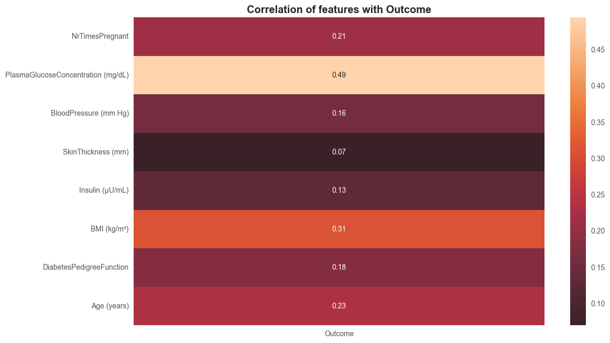

# Diabetes Risk Factor Analysis

This project explores the **Pima Indians Diabetes dataset** to identify factors most strongly associated with diabetes.  
Using **Pandas, NumPy, and Matplotlib**, the dataset is cleaned, analyzed, and visualized to uncover key insights.

---

## Dataset

- **Source**: [Pima Indians Diabetes Database (Kaggle)](https://www.kaggle.com/datasets/uciml/pima-indians-diabetes-database)  
- **Rows**: 768 patients  
- **Features**: 8 medical/demographic attributes + 1 outcome label  

| Feature                   | Metric of Measurement               |
|----------------------------|------------------------------------|
| Pregnancies               | Count (number of times)             |
| Glucose                   | mg/dL (2-hour plasma glucose)       |
| BloodPressure             | mm Hg (diastolic blood pressure)    |
| SkinThickness             | mm (triceps skinfold thickness)     |
| Insulin                   | μU/mL (2-hour serum insulin)        |
| BMI                       | kg/m² (body mass index)             |
| DiabetesPedigreeFunction  | Unitless score                      |
| Age                       | Years                               |
| Outcome                   | Class (0=non-diabetic, 1=diabetic)  |

---
## Repository Structure

```
Diabetes-Analytics-Project/
│
├── data/
│   └── diabetes.csv
│
├── notebooks/
│   └── diabetes-analyses.ipynb
│
├── reports/
│   ├── 4-1-plots-age-MBI-pregnancies-insulin-outcome.png
│   ├── age-distribution-plot.png
│   ├── age-groups-diabetes.png
│   ├── BMI-diabetes.png
│   ├── glucose-diabetes.png
│   ├── glucose-distribution-plot.png
│   ├── insulin-diabetes.png
│   ├── outcome-corr-heatmap.png
│   └── pregnancy-diabetes-prevalence.png
│
├── README.md
└── requirements.txt
```

## Project Workflow

1. **Data Cleaning**
   - Removed/imputed biologically impossible values (e.g., BMI = 0).
   - Standardized column names for clarity.

2. **Exploratory Data Analysis (EDA)**
   - Descriptive statistics for all features.
   - Comparisons between diabetic vs non-diabetic patients.

3. **Visualization**
   - Histograms (e.g., age, BMI distributions).
   - Boxplots (e.g., insulin).
   - Scatter plots (e.g., blood pressure vs glucose).
   - Prevalence charts (e.g., age groups).
   - Correlation heatmap (feature importance relative to Outcome).

4. **Analysis & Insights**
   - Glucose, BMI, and Age are the strongest predictors of diabetes.
   - Diabetes prevalence rises with age and higher pregnancy counts.
---

## Key Findings

- **Glucose levels** are the strongest predictor of diabetes (correlation ≈ 0.49).  
- **BMI and Age** are significant supporting factors.  
- **Pregnancies** show a positive relationship with diabetes prevalence.  
- Other features (Blood Pressure, Insulin, Skin Thickness) are weaker predictors individually.  

Together, these results highlight that diabetes risk is shaped by **metabolic (glucose, BMI), demographic (age), and reproductive (pregnancies)** factors.

---

## Sample Visualizations

| Correlation with Outcome | Diabetes Prevalence by Age Group |
|--------------------------|----------------------------------|
|  |  |

---

## Installation & Usage

1. Clone the repository:
   ```bash
   git clone https://github.com/xhensilahoxha/diabetes-analysis.git
   cd diabetes-analysis
   ```

2. Install dependencies:
   ```bash
   pip install -r requirements.txt
   ```

3. Open the notebook:
   ```bash
   jupyter notebook notebooks/diabetes-analyses.ipynb
   ```

---

## Requirements

- Python 3.8+  
- pandas  
- numpy  
- matplotlib  
- seaborn  

(see `requirements.txt`)

---

## License
This project is under the [MIT License](LICENSE).

---

## Author
Developed by **Xhensila Hoxha** as a practice project for data analytics.
